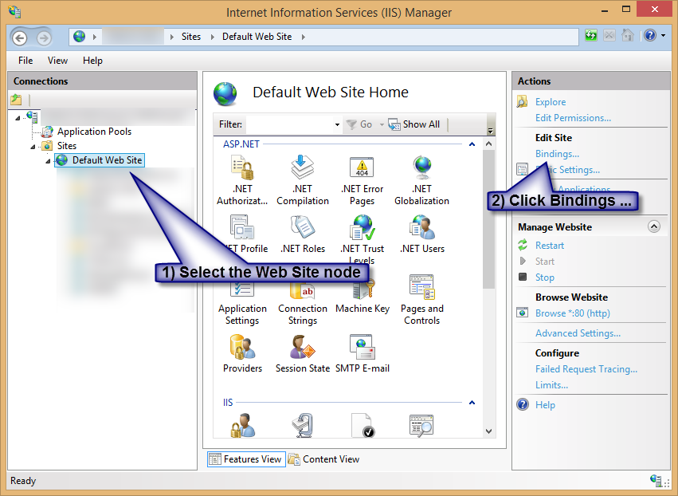
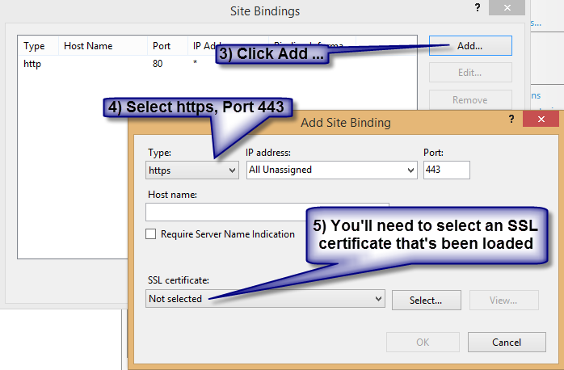

> I have my web application serving through HTTP over port 80, but the customers require data to be sent security through HTTPS.
> 
> How would I go about setting up this application as HTTPS over port 443 in IIS?

# The GUI Way (inetmgr)

